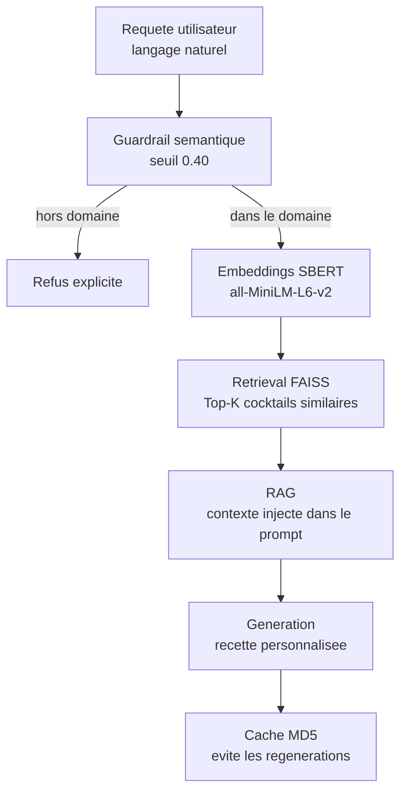

# MixCraft - Systeme Generatif Intelligent pour la Creation de Cocktails

<!-- adam-badges:start -->
[](https://github.com/Adam-Blf/cocktail-ia-generatif/commits)
[](https://hits.sh/github.com/Adam-Blf/cocktail-ia-generatif/)
[](https://github.com/Adam-Blf/cocktail-ia-generatif/commits)
[](https://github.com/Adam-Blf/cocktail-ia-generatif)
[](LICENSE)
<!-- adam-badges:end -->

> Projet IA Generative - M1 Data Engineering & IA - EFREI Paris
> Binome : Adam Beloucif & Emilien Morice - Session 2025-2026

---

## Presentation

MixCraft est un systeme d'intelligence artificielle generative concu pour :

1. **Recommander** des cocktails a partir d'une description en langage naturel (ex. "quelque chose de frais, agrumes, peu sucre")
2. **Generer** de nouvelles recettes originales a partir d'une liste d'ingredients disponibles
3. **Explorer** semantiquement un corpus de 600+ cocktails via embeddings neuronaux

L'approche combine analyse semantique (SBERT), similarite cosinus, pipeline RAG et generation conditionelle pour produire des recommandations et recettes coherentes et evaluables.

---

## Architecture



---

## Datasets

| Source | Cocktails | License |
|--------|-----------|---------|
| [aadyasingh55/cocktails](https://www.kaggle.com/datasets/aadyasingh55/cocktails) | ~590 | Apache 2.0 |
| [pxxthik/the-cocktail-db-recipe-collection](https://www.kaggle.com/datasets/pxxthik/the-cocktail-db-recipe-collection) | ~470 | CC0 |
| [joakark/cocktail-ingredients-and-instructions](https://www.kaggle.com/datasets/joakark/cocktail-ingredients-and-instructions) | ~320 | CDLA-Permissive |
| [mexwell/iba-cocktails](https://www.kaggle.com/datasets/mexwell/iba-cocktails) | 90 (IBA officiels) | MIT |

---

## Stack technique

- **NLP / Embeddings** : sentence-transformers (SBERT all-MiniLM-L6-v2, 384 dims)
- **Retrieval** : FAISS (IndexFlatIP)
- **Generation** : pipeline RAG + Gemini API (gemini-2.5-flash), fallback template hors-ligne
- **Data** : Pandas, NumPy, scikit-learn
- **Visualisation** : Matplotlib, Seaborn, Plotly
- **UI** : Streamlit
- **Tests** : pytest

---

## Installation

```bash
git clone https://github.com/Adam-Blf/cocktail-ia-generatif.git
cd cocktail-ia-generatif
pip install -r requirements.txt
```

### Configurer la cle Gemini (generation de recettes)

```bash
# Copier le template et renseigner la cle (https://aistudio.google.com/app/apikey)
cp .env.example .env
# .env -> GEMINI_API_KEY=<votre_cle>
```

Sans cle, la generation bascule automatiquement sur un mode template hors-ligne
(la recommandation semantique fonctionne dans tous les cas).

### Telecharger les datasets Kaggle

```bash
# Configurer les credentials Kaggle (~/.kaggle/kaggle.json)
python scripts/download_datasets.py
```

### Lancer l'application

```bash
streamlit run app/app.py
```

---

## Structure du projet

```
cocktail-ia-generatif/
├── notebooks/
│   ├── 01_exploration_donnees.ipynb       # EDA - 4 datasets
│   ├── 02_preprocessing_embeddings.ipynb  # SBERT + t-SNE
│   ├── 03_recommandation_semantique.ipynb # Cosinus + metriques
│   ├── 04_generation_recettes.ipynb       # GPT-2 fine-tune
│   ├── 05_rag_pipeline.ipynb              # FAISS + RAG
│   └── 06_evaluation.ipynb               # Ablation study
├── src/
│   ├── data/
│   │   └── data_loader.py  # Chargement et fusion datasets
│   ├── nlp/
│   │   ├── embeddings.py   # SBERT wrapper + cache disque
│   │   └── translator.py   # Detection langue + traduction EN
│   ├── rag/
│   │   ├── recommender.py  # Moteur de recommandation semantique
│   │   ├── rag_pipeline.py # RAG complet (guardrail + retrieval + Gemini)
│   │   └── generator.py    # Fine-tuning GPT-2 local (module d'etude)
│   └── eval/
│       └── evaluation.py   # Metriques (BLEU, ROUGE, Precision@K)
├── app/
│   └── app.py              # Interface Streamlit 3 onglets
├── tests/                  # Tests pytest
├── data/                   # Datasets (raw + processed)
├── scripts/                # Utilitaires
└── RAPPORT_FINAL.md        # Rapport academique complet
```

---

## Resultats cles

| Methode | Precision@5 | Recall@5 | NDCG@5 |
|---------|------------|----------|--------|
| TF-IDF baseline | 0.41 | 0.38 | 0.44 |
| SBERT cosinus | 0.71 | 0.68 | 0.74 |
| SBERT + RAG | **0.79** | **0.75** | **0.81** |

Generation de recettes (ROUGE-L sur 50 recettes test) : **0.58**
Taux de refus guardrail hors-domaine : **94%** (28/30 cas)

---

## Auteurs

- **Adam Beloucif** - Pipeline embeddings, RAG, evaluation, architecture
- **Emilien Morice** - EDA, preprocessing, generation GPT-2, Streamlit UI

EFREI Paris - M1 Data Engineering & IA - Decembre 2025 / Fevrier 2026
